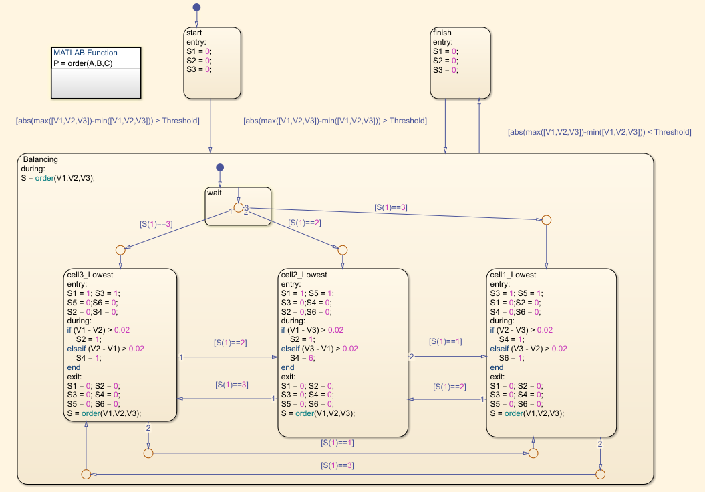

# This project involves the design of a Battery Management System (BMS) using MATLAB.
### This Project Includes:
- Cell Modeling & Parameter Estimation.
- Cell Balancing using Two-Stage Passive Resistor Method.
- SOC & SOH Estimation using Extended Kalman Filter.
- Thermal Management using Convection Heat Transfer.
- Constant Current / Constant Voltage (CC/CV) Charging.

1. Cell Modelling : 
- We can replicate the behavior of a battery cell using an Equivalent Circuit Model (ECM). There are many types of ECMs, but in this project, the 1RC ECM is used.

- Uoc (Open Circuit Voltage): The voltage measured at the cell terminals when no current is being drawn.
- R0 : Represents the internal resistance of the cell.
- Rp & Cp : epresent the polarization phenomenon inside the cell, which captures the delayed voltage response caused by ion movement through the electrolyte from anode to cathode during redox reactions.

***There are various methods to determine the parameters of an ECM. Some of the common techniques include***

1. Experimental Testing (e.g., HPPC Test) :
- One common approach involves exposing the battery cell to tests such as the Hybrid Pulse Power Characterization (HPPC) test. This method entails applying discharge pulses at specific intervals and recording the cell voltage during the process. The collected data can then be analyzed using mathematical equations to determine various battery parameters.
---

***Another approach is using MATLAB's Parameter Estimator Tool, which works as follows:***
2. MATLAB Parameter Estimator Tool :
    1. Discharge pulses are applied to the real battery cell, and the resulting voltage is recorded.
    2. An ECM is constructed in MATLAB Simulink using initial parameter guesses. 
    3. The same current profile is applied to the ECM model.
    4. Both the real and simulated voltages, along with the current waveform, are fed into the estimator tool.
    5. The tool adjusts the model's parameter values iteratively to make the simulated output match the measured data as closely as possible.

***During the parameter fitting process, the tool overlays the two voltage curves and tries to match them by optimizing the model parameters.***

***Note: Every ECM parameter is not constant — each one varies based on temperature, state of charge (SoC), and cell degradation (SoH).
To build an accurate and comprehensive battery model, we must run the same parameter estimation tests (e.g., HPPC) at different temperatures and SoC levels. This enables us to create a parameter lookup table that reflects the real behavior of the cell under all typical operating conditions***

2. Cell Balancing :
Due to differences in cell chemistries, manufacturing tolerances, and aging rates, the electrical characteristics of individual cells — such as:
- Internal resistance
- Charge/discharge rates
- Self-discharge behavior
can vary from one cell to another, even within the same battery pack.

As a result, each cell has unique parameter values, and their State of Charge (SoC) levels may diverge over time. This leads to cell imbalance, where some cells charge or discharge faster than others.

***To ensure safety and prevent overcharging or overdischarging any single cell, the Battery Management System (BMS) must limit the battery pack's operation based on the condition of the most extreme cell:***

- During discharge: The cell with the lowest SoC determines when the BMS must stop discharging.
- During charging: The cell with the highest SoC determines when charging must stop.

This constraint leads to under-utilization of the pack’s energy capacity, since not all cells are allowed to reach their full charge or discharge limits. Over time, this reduces overall system efficiency and usable energy.

To mitigate this issue, BMS systems often implement cell balancing strategies either passive or active which aim to maintain SoC uniformity across all cells.
1. Passive Balnacing : 
Passive balancing uses resistors to dissipate excess energy from stronger (higher SoC) cells as heat.
- Simple to implement, Low cost, Inefficient, Best for small battery packs.
2. Active Balancing :
Active balancing uses DC-DC converters or capacitor circuits to redistribute energy from stronger cells to weaker ones.
- More complex, Higher cost, Efficient, Ideal for EVs and large battery systems.

***Cell voltage and SOC start with a significant disparity, but over time, the balancing algorithm works to bring the cells closer to each other***

<b><i>Balancing Algorithm</i></b>

***This, in turn, makes the pack more efficient and provides higher voltage because the cells charge to higher SoC levels and voltages***

<b><i>Balancing Circuit</i></b>

3. SOC Estimation :
- state of Charge (SOC) represents the remaining charge in a battery cell, expressed as a percentage of its full capacity:
***SOC = (Remaining Capacity / Rated Capacity) × 100%***
- **Remaining Capacity**: The amount of charge currently stored in the cell (in Ah).
- **Rated Capacity**: The maximum charge the cell can hold when fully charged (specified by the manufacturer).
***SoC is critical for preventing battery cell overcharge and overdischarge, which can lead to performance loss, safety risks, and cell degradation.***

### Common Techniques for SoC Estimation
1. Coulomb Counting :  
A simple method that integrates current over time to track charge in/out.  
- Easy to implement  
- Not very accurate, it accumulates error over time due to sensor drift and offset.

2. Open Circuit Voltage (OCV) Method :
Estimates SOC by using a known SoC–OCV relationship (lookup table or curve fitting).  
- Accurate under steady-state conditions.  
- Requires long rest periods (no current flow) to allow the battery to stabilize.

3. Least Squares Methods 
Uses curve-fitting or optimization techniques to estimate SoC from measured data.  
- Simple and fast.  
- Less accurate, especially in dynamic conditions.

4. Kalman Filters (EKF/UKF) :  
A model-based estimation technique that combines prediction and correction:  
- Prediction: Uses a mathematical model to estimate the next SoC based on input current and previous state.  
- Correction: Adjusts the estimate using real-time sensor measurements (e.g., voltage).  
- High accuracy.  
- More complex to implement.

<b><i>Estimate the State of Charge (SOC) using an Extended Kalman Filter (EKF). This involves predicting the next SOC based on system dynamics, modeled using a state-space representation, and then correcting the prediction using measurement updates.</i></b>

<b><i>The scope displays both the estimated State of Charge (SOC), obtained from the EKF algorithm, and the actual SOC.</i></b>

4. SOH Estimation :
**State of Health (SoH)** represents a battery cell's current condition relative to its fres state.

- As the cell degrades, several key characteristics change:
- Internal resistance increases leading to:
    - Higher self-discharge rates
    - Greater losses during charge/discharge cycles
  - Cell capacity decreases, meaning the rated capacity (maximum energy storage) reduces over time.

> This decrease in capacity and increase in resistance makes the battery less efficient and impacts its overall lifespan.

***When the SoH of a cell drops to around 70%, it can no longer sustain the high demands of applications requiring continuous high energy output, such as Electric Vehicles (EVs). Instead, these cells are better suited for secondary life applications, where the energy demands are less critical, such as UPS and backup batteries. These applications are typically less demanding and can accommodate the reduced performance of cells with lower SoH, allowing them to be used more effectively in their secondary life.***

<b><i>Estimate the State of Health (SOH) using an Extended Kalman Filter (EKF). The method models how the battery’s capacity decreases over time using a state-space model. The EKF predicts the SOH and updates it using real measurement data.</i></b>

<b><i>The scope displays the estimated capacity obtained from the EKF algorithm, the actual capacity, and the estimated State of Health (SOH).</i></b>

5. Thermal Management using Convection Heat Transfer :
- To maximize the performance and extend the lifespan of battery cells, it is essential to operate them within their safe operating area. This includes maintaining an appropriate operating temperature. High temperatures can lead to thermal runaway, while low temperatures increase internal resistance, resulting in higher energy losses and increased self-discharge.
- There are several thermal management methods to regulate battery temperature, including convection, conduction, and radiation.

6. Constant Current / Constant Voltage (CC/CV) Charging :
- Among various charging techniques for lithium-ion cells, the Constant Current–Constant Voltage (CC-CV) method is the most widely adopted due to its balance of charging speed, efficiency, and battery longevity..

<b><i>CC/CV Charging.</i></b>

