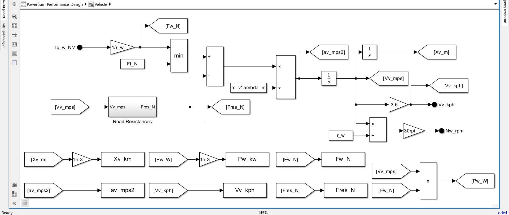
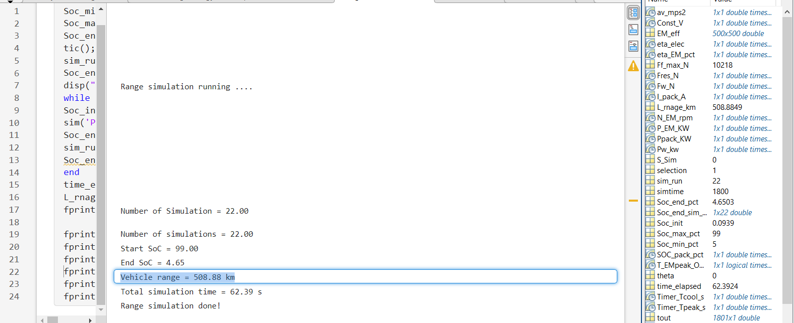

### This project involves the design of an electric powertrain system based on data from the Tesla Model 3.

#### Input Data

| Parameter                            | Value                    |
|--------------------------------------|--------------------------|
| Transmission Gearbox Ratio           | 9                        |
| Tire Specifications Front/Rear       | 235/45R18                |
| Battery Nominal Voltage              | 355 V                    |
| Maximum Curb Mass Total/Front/Rear   | 1777 / 864 / 913         |
| TPMLM Total/Front/Rear               | 2193 / 986 / 1207        |
| Aerodynamic Drag Coefficient         | 0.23                     |
| Range                                | 491 km                   |
| Acceleration                         | 0 to 100 km/h in 6.1 sec |
| Top Speed                            | 225 km/h                 |
| Maximum Frontal Area                 | 2.22 m2       |

***The goal of the powertrain design is to achieve key performance requirements, including a top speed of 225 km/h, acceleration from 0 to 100 km/h in 6.1 seconds, and a driving range of 491 km.***

#### Design Process Overview
1. Calculation of Vehicle Parameters.
2. Calculation of Running Resistance Forces.
3. Electric Motor Sizing.
4. Calculation of Vehicle Average Energy Consumption and Battery Sizing.

---
1.Calculation of Vehicle Parameters

***Using vehicle input data, I calculated the front and rear axle mass distribution, wheel radius, center of gravity (CoG), and the distances from the CoG to both the front and rear axles***

2.Calculation of Running Resistance Forces.

***Using vehicle input data along with the previously calculated vehicle parameters, I evaluated the vehicle under different driving conditions—such as driving on flat roads, inclined surfaces with varying slopes, during acceleration, curb climbing, and at different speeds. Based on these scenarios, I calculated the running resistance forces acting on the vehicle, including rolling resistance, aerodynamic drag, slope force and acceleration force.***

3.Electric Motor Sizing.

***By calculating the resistive forces, we can determine the required torque and tractive force. With this information, along with the transmission gear ratio and performance requirements such as the vehicle's rated and maximum speed, we can select an appropriate motor***

4.Calculation of Vehicle Average Energy Consumption and Battery Sizing.

***By applying a driving cycle to the vehicle in this project, the WLTC cycle we can calculate the average energy consumption in Wh/km. Using this value, along with the performance requirement of a 491 km range, we can determine the required battery capacity***

#### I used MATLAB Simulink to model the powertrain components to meet performance targets, including a top speed of 225 km/h, 0–100 km/h acceleration in 6.1 seconds, and a driving range of 491 km.

## Design Overview

<b><i>System Architecture Development Using System Composer<i></b>

1.Cycle Component.

<b><i>In Cycle Component we can Apply different driving cycles to the vehicle such as WLTC driving Cycle, Maximum speed with different Road conditions, Constant Velocity<i></b>

2.Driver Component.

<b><i>In the Driver component, the error between the actual vehicle speed and the target speed provided by the Cycle component is calculated. A PID controller is then used to generate the required torque to achieve the target speed.<i></b>

PID Controller

<b><i>The PID controller is used to minimize the error between the actual and target vehicle speeds. It includes an anti-windup mechanism that freezes the integral term when the output exceeds the electric machine's maximum torque.<i></b>

3.Electric Machine Component.

<b><i>The electric machine component takes the output torque from the Driver component as input and generates the required torque. It also features a thermal protection mechanism that limits the peak torque to a specified duration.<i></b>

Thermal Protection

<b><i>The thermal protection mechanism operates by limiting the output of peak torque to a specified duration. After this time, a cooling timer activates, allowing the system to cool down. Once the cooling period is complete, the peak torque can be output again.<i></b>

4.Transmission Component.

<b><i>The transmission is a torque-speed converter that adjusts the electric machine's torque and speed based on its gear ratio.<i></b>

5.Vehicle Component.

<b><i>In the Vehicle component, we calculate the resistance forces the vehicle will encounter, as well as its speed, acceleration, and traveled distance.<i></b>

5.Battery Component.

<b><i>In the Battery component, we calculate the pack voltage, current, and depth of discharge (DOD).<i></b>

---

***In this step, we test our design to verify whether it meets the performance requirements: a 491 km range, 0 to 100 km/h acceleration time of 6.1 seconds, and a top speed of 225 km/h.***

1.Range Test.

<b><i>In the range test, the vehicle achieved a range of 491 km according to the WLTC driving cycle.<i></b>

2.Acceleration Time Test.

<b><i>In the acceleration Test, the vehicle reached 100 km/h in 6.11 seconds.<i></b>

3.Top Speed Test.

<b><i>In the top speed test, the vehicle reached a maximum speed of 225 km/h.<i></b>

